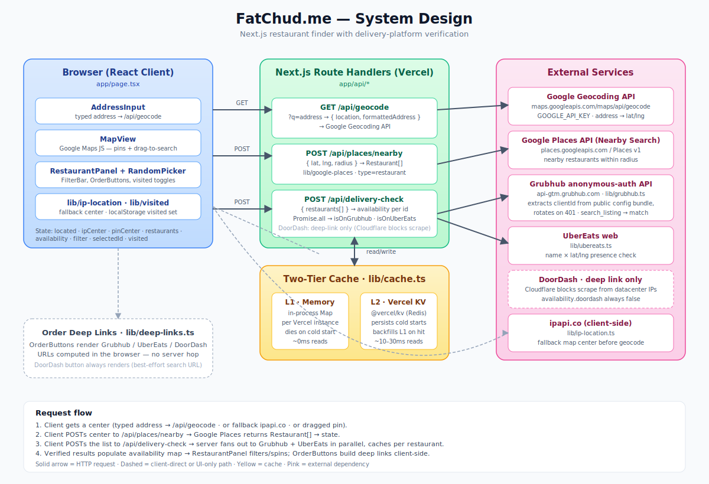

# FatChud.me

Web app for figuring out where to order delivery from. Shows nearby restaurants on a map, checks which of DoorDash / UberEats / Grubhub actually carry each one, and only surfaces "order on platform X" buttons for the platforms where the restaurant was found. Mark places you've been and the pins turn green.

Built with Next.js 16, React 19, TypeScript, Tailwind v4, and MapLibre GL JS over OpenFreeMap tiles — so no Mapbox or Google Maps fees on map rendering. The only paid dependency is Google Places (New) for restaurant data.

## System design



## Features

- **Map-first discovery.** Up to 60 nearby restaurants from Google Places, plotted as rating-bearing pins.
- **Cross-platform delivery check.** Every shown restaurant has been independently verified on each delivery platform in parallel. If nothing carries it, it doesn't appear at all.
- **Smart order buttons.** Per-restaurant deep-link buttons appear only for platforms where the restaurant was found — no dead links.
- **"Been here" tracking.** Click a checkbox to mark a visit; pins turn green and persist across sessions via `localStorage`.
- **Random picker with visited filters.** Spin a roulette-style picker with three modes: all restaurants, exclude visited, or only visited.
- **No-permission default location.** IP-based geolocation with multi-provider fallback puts the user roughly where they are without a browser prompt. Address input upgrades to precise centering.

## Interesting bits

### Three completely different scraping strategies

Each delivery platform exposes a wildly different surface, so each scraper attacks the problem differently:

- **Grubhub** — Real OAuth-style anonymous auth: `POST /auth` with a public client ID, get a bearer token, hit `/restaurants/search/search_listing`. (`lib/grubhub.ts`)
- **UberEats** — Undocumented but completely unauthenticated public endpoint at `/api/getFeedV1` with a literal `x-csrf-token: x` header. No tokens, no signing — just works. (`lib/ubereats.ts`)
- **DoorDash** — *Disabled in production.* The original approach was to fetch the server-rendered `/search/store/<query>/` page and regex-parse `store_name`/`store_latitude`/`store_longitude` triples out of the React Server Components stream. Cloudflare/Datadome now block every scrape attempt from Vercel — see [Enabling DoorDash scraping locally](#enabling-doordash-scraping-locally) below for what's required to get it working on a local clone. The DoorDash order button still renders unconditionally as a best-effort deep link.

### Self-healing Grubhub auth

Grubhub rotates their public `clientId` every few weeks, breaking the auth flow. The scraper detects this and recovers without manual intervention:

1. On a 401 from `/auth`, fetch `https://www.grubhub.com/` and grep the HTML for the current `grubhub-config-*.js` bundle filename
2. Fetch that bundle from `https://assets.grubhub.com/`, regex-extract the new `clientId`
3. Update the in-memory cache and retry the auth once

Concurrency-safe via an in-flight Promise lock so a flood of 401s shares a single recovery attempt, and rate-limited to one rotation per 5 minutes per process so a broken extraction doesn't hammer Grubhub.

### Cross-source restaurant matching

A restaurant's name on Google Places rarely matches its name on a delivery platform exactly — "Joe's Pizza" vs "Joe's Pizza (Greenpoint)" vs "Joe's Pizza Restaurant". The match logic in each scraper:

1. **Normalize**: lowercase, strip parentheticals, collapse to alphanumeric-only
2. **Bidirectional substring**: either normalized name is a substring of the other
3. **Coord proximity**: haversine distance <150 m from Google's coordinates — filters out chain locations 20 miles away that happen to share the name

### Multi-provider IP geolocation fallback

Default centering tries three providers in sequence — `ipapi.co`, `geojs.io`, `ipwho.is` — each with their own JSON shape and quirks. First success wins. If all three fail, the map shows a world view and the address input still works. Single-provider rate limits stop being an outage.

### Imperatively-managed map markers

Pins live in a `Map<id, MapLibreMarker>` ref rather than re-rendering React on every state change. Selected/visited states toggle class names on the existing DOM elements, so the only React work that touches markers is when the restaurant list itself changes. On the first IP-center arrival the app uses `jumpTo` (instant) instead of `flyTo` (slow animated zoom from world view) to avoid the perception that the map is stuck on a global view.

### Field-masked Places API with pagination

Google's Places API (New) prices by field-mask SKU tier. The query requests exactly the fields the UI renders — dropping any one bumps the call down a tier. For higher result counts the app uses `places:searchText` with `nextPageToken` pagination (3 pages × 20 = up to 60 results) instead of `places:searchNearby`'s hard 20-result cap.

## Local development

```bash
npm install
cp .env.local.example .env.local
# Add your GOOGLE_API_KEY
npm run dev
```

Requires a Google Cloud project with **Places API (New)** and **Geocoding API** enabled. Restrict the key to HTTP referrers from your deployment domain — the only credential is server-side, but a leaked unrestricted key is still cheap to abuse.

### Enabling DoorDash scraping locally

DoorDash is wired up as deep-link-only in production because Cloudflare/Datadome will not let the scraper through from Vercel. From a developer machine on a residential ISP it generally *does* work, which is the only setup where the original scraper is still useful.

**To turn it back on for a local clone:**

1. Restore `lib/doordash.ts` from git history (the file was removed when production gave up on it — see `SCRAPER_NOTES.md` for the rationale).
2. In `app/api/delivery-check/route.ts`, add `isOnDoorDash` to the `Promise.all` fan-out alongside `isOnGrubhub` / `isOnUberEats`, and write the result into `availability.doordash` instead of the hardcoded `false`.
3. Run `npm run dev` and hit `/api/delivery-check` with a known-good restaurant to confirm the response now carries `"doordash": true` where expected.

**Why this only works locally — and what specifically fails on Vercel:**

DoorDash's edge stack gates on two independent signals; you need to pass both, and Vercel fails both.

- **IP reputation.** Direct fetches from Vercel's datacenter IP ranges get an immediate `403` from Cloudflare. A residential proxy (we tried this via a `DOORDASH_PROXY_URL` env var) only partially helps — some requests get through, but enough are met with `403` or `ECONNRESET` that the per-restaurant check is unusably flaky.
- **TLS fingerprint (JA3).** Node's default TLS ClientHello looks nothing like Chrome's. Even when a residential proxy lands the request on a "good" IP, Datadome flags the handshake and drops the connection. We tried `cycletls` to spoof a Chrome JA3 over the residential proxy — still blocked. A paid web-unlocker service (Bright Data, ScraperAPI, etc.) that handles both signals end-to-end would likely work, but is out of scope for the free-tier deploy.

Running locally sidesteps both: your home ISP IP isn't on any datacenter blocklist, and the same vanilla Node TLS handshake that gets flagged from `*.vercel.app` is unremarkable when it originates from a residential connection. No proxy or JA3 spoofing needed.

⚠️ Keep DoorDash *disabled* on any branch you intend to deploy. If `isOnDoorDash` is in the fan-out on Vercel, every restaurant returns `false` from that branch of the check, the global `available` filter shrinks accordingly, and the visible restaurant list silently gets worse.

## Operational notes

All three scrapers reverse-engineer public web endpoints with no formal contract — see `SCRAPER_NOTES.md` for documented per-platform failure modes, recovery procedures, and how to drop a platform entirely if it stops working. The Grubhub rotation logic is the only fully automatic recovery; UberEats and DoorDash breakages still require human eyes.
